# Лабораторная работа №1: Создание виртуальной машины Linux и работа с командной строкой
**Студент:** Колганов Илья Л-01

## 1. Подготовка среды и установка ОС
Поставил Ubuntu Server на виртуалку и залогинился под kolganov. 
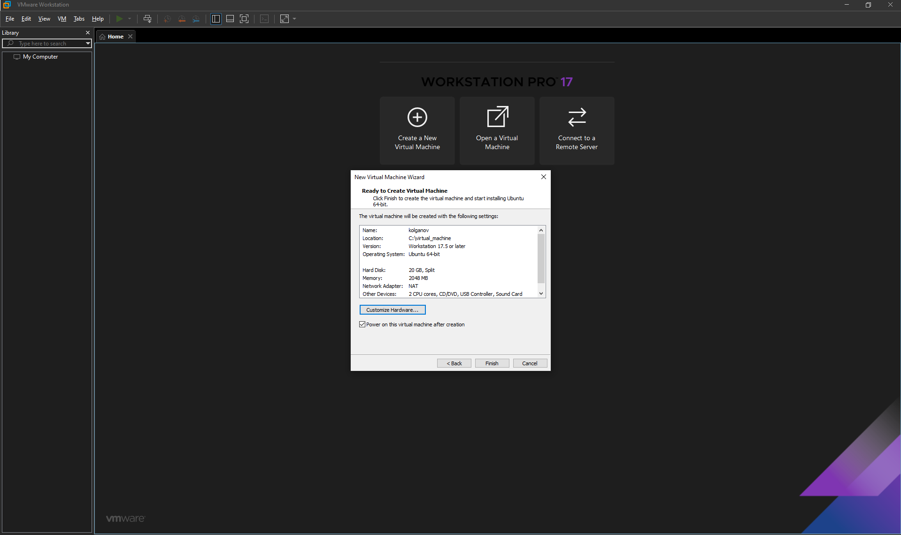
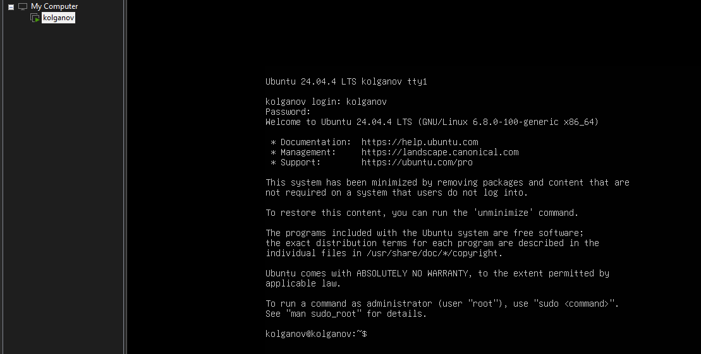

## 2. Сбор системной информации
Собрал информацию о системе и сохранил в лог.

## 3. Сетевые настройки и безопасность
Проверил сеть, получил IP-адрес и посмотрел открытые порты, 22-й  активен.
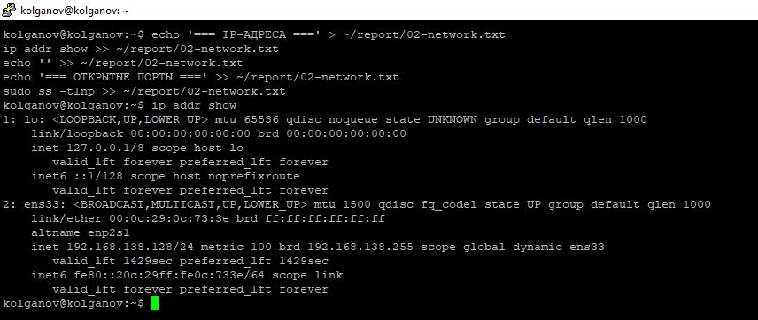
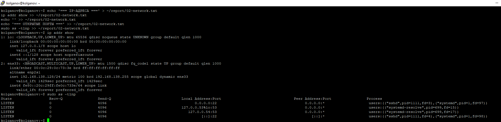

## 4. Сервис SSH
Убежился, что SSH активна и слушает 22-й порт.
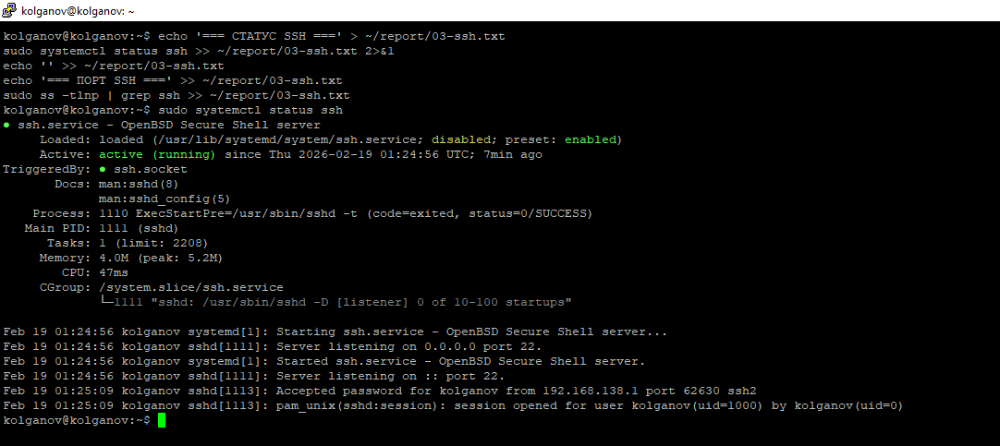
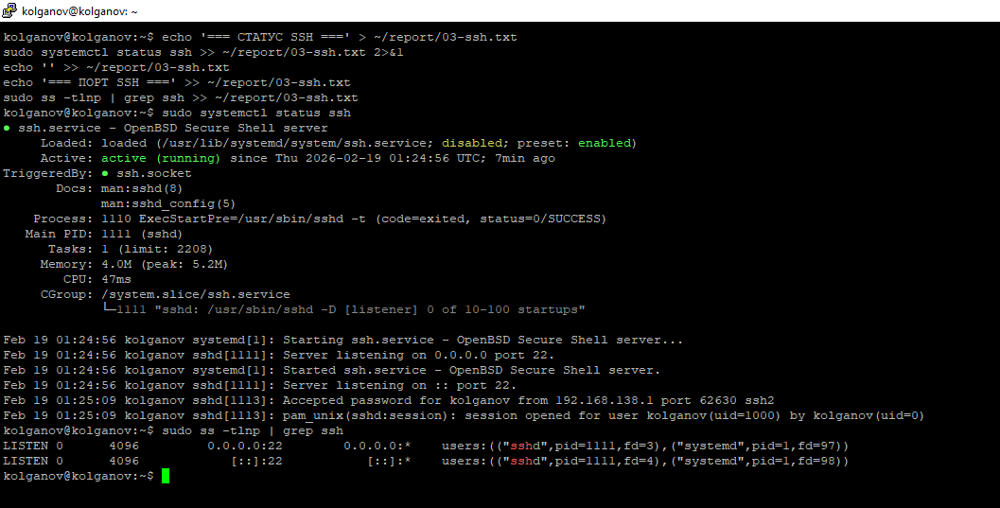

## 5. Пользователи и группы
Вывел список всех юзеров, использующих /bin/bash, создал нового пользователя boardy и проверил ID и группы нового пользователя.
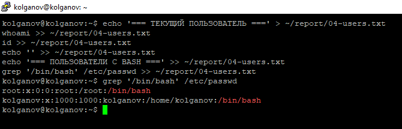
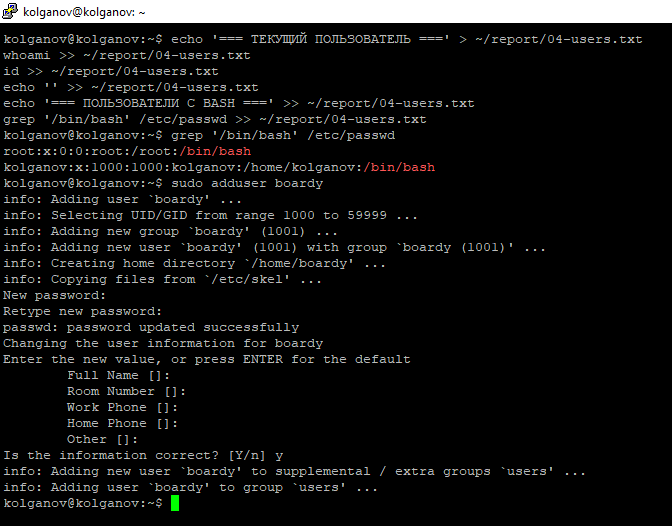
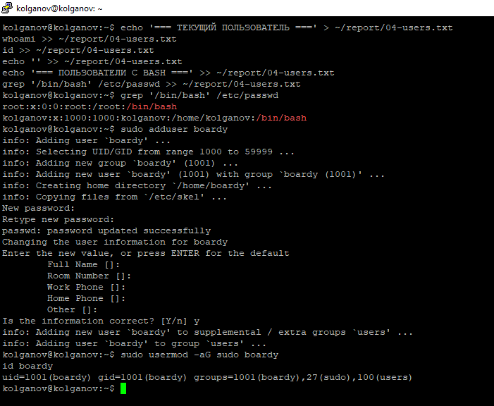

## 6. Дерево каталогов
Вывел структуру корневого каталога и просмотрел содержимое домашней папки.
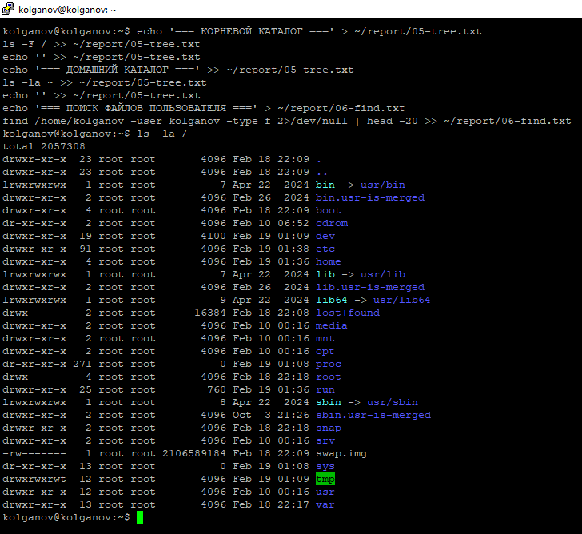
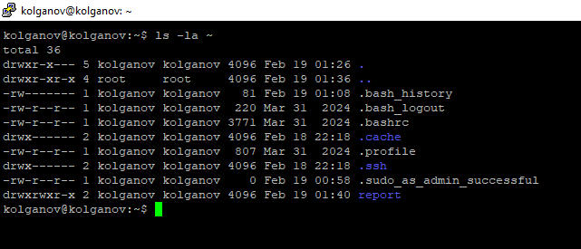

## 7. Права доступа
Сверил права доступадля основных системных папок и протестировал смену прав с помощью chmod.
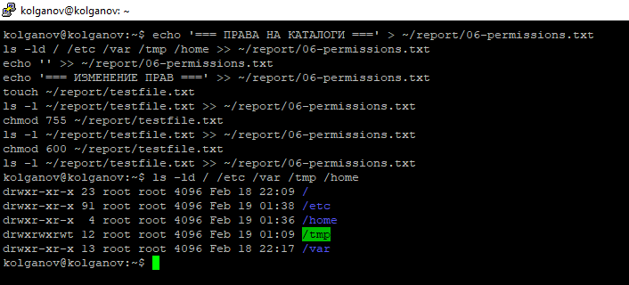
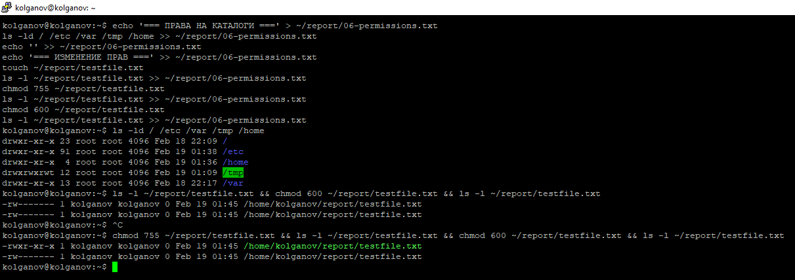

## 8. Установленные пакеты и сервисы
Вывел список установленных пакетов и просмотрел список всех запущенных сис.служб.
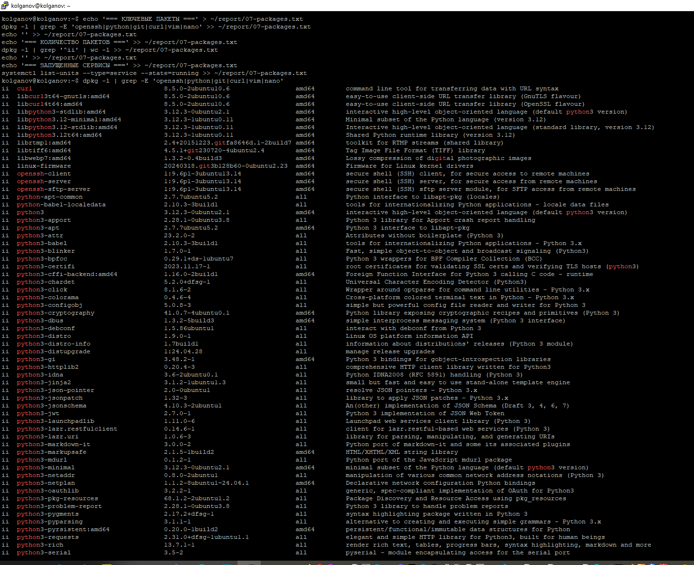
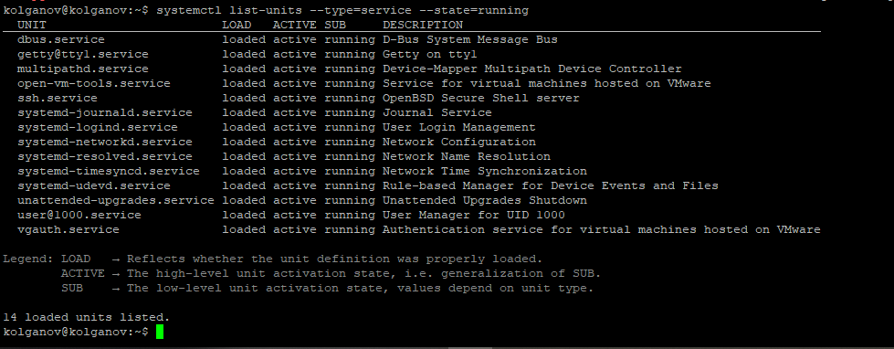

## 9. Конвейер и перенаправление
- Отсортировал процессы по потреблению RAM
- Посчитал количество запущенных процессов для каждого юзера
- Нашел самые крупные файлы и папки в директории /var.
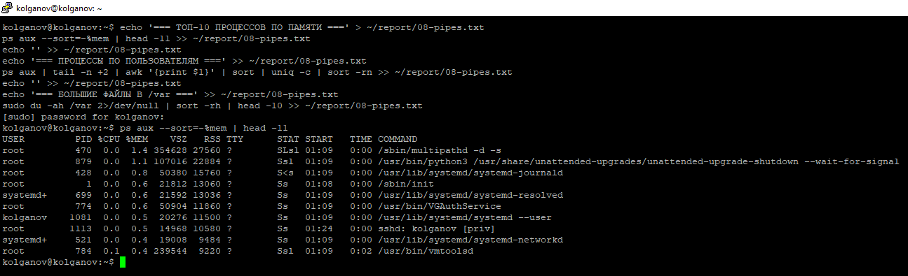
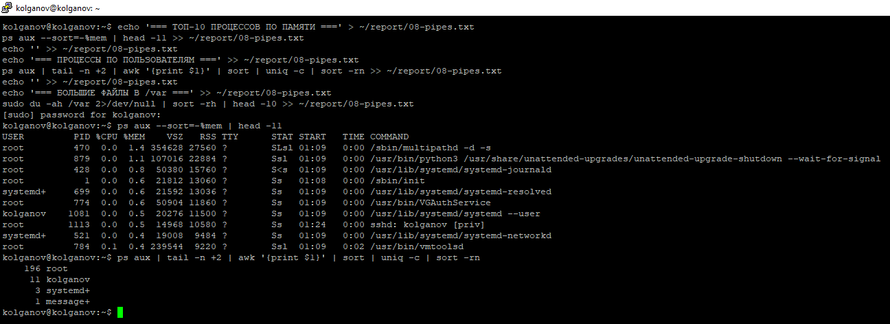
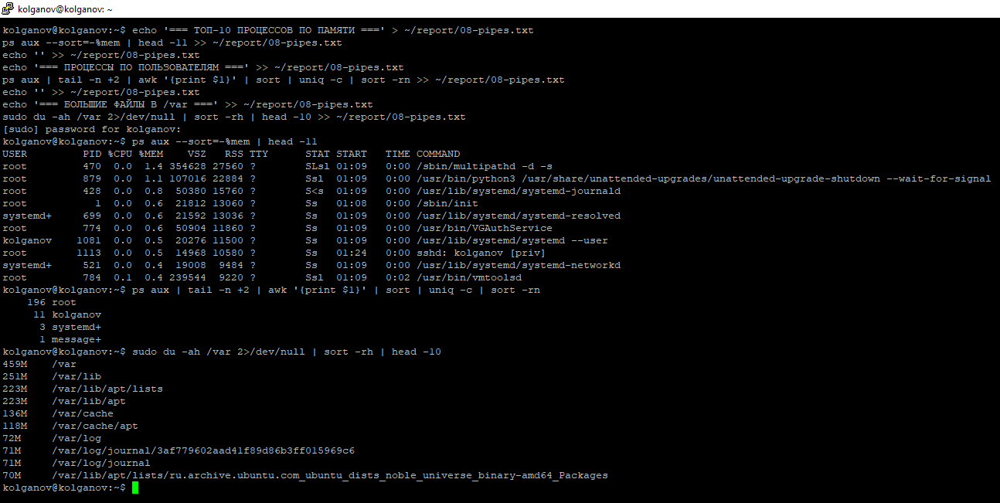

## 10. Итоговый отчет
Объединил все логи в финальный файл.
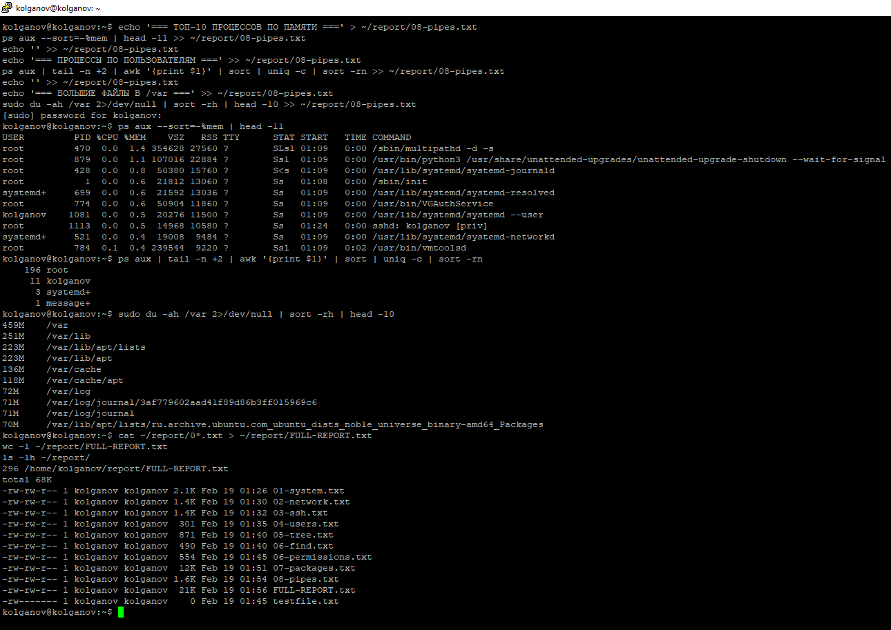
