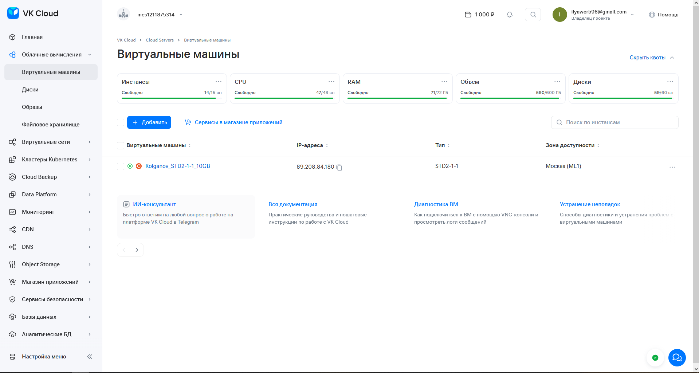
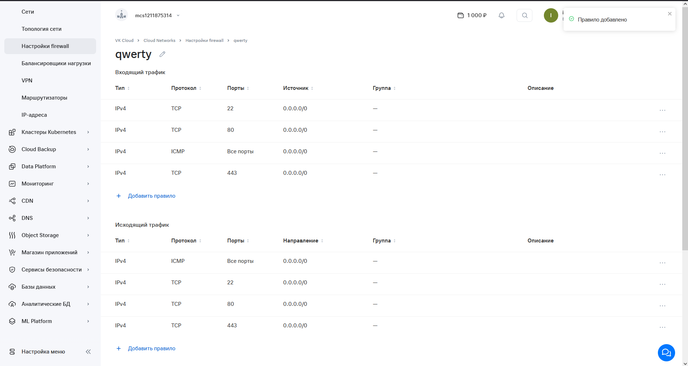
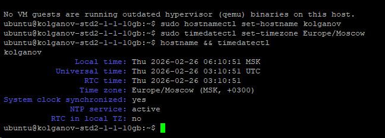
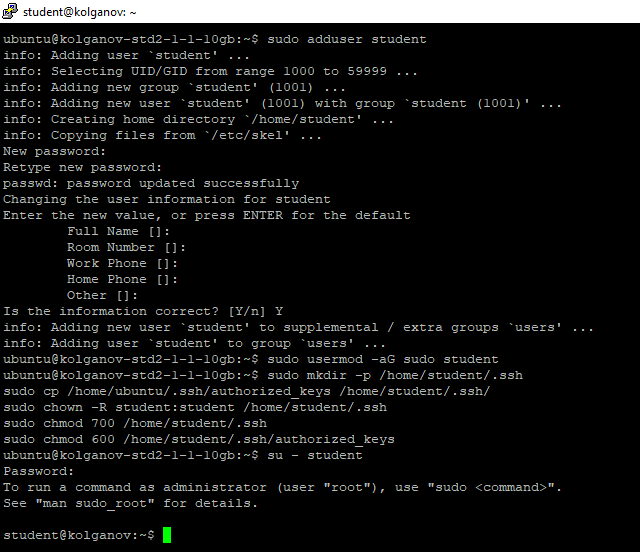
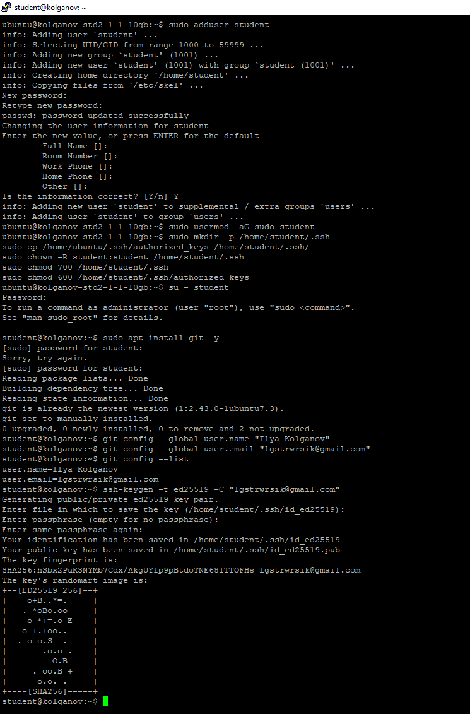
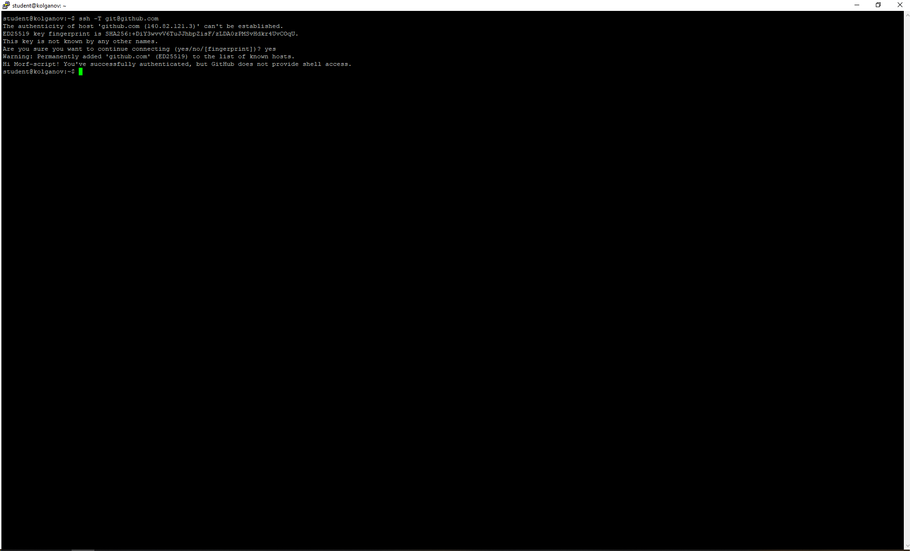
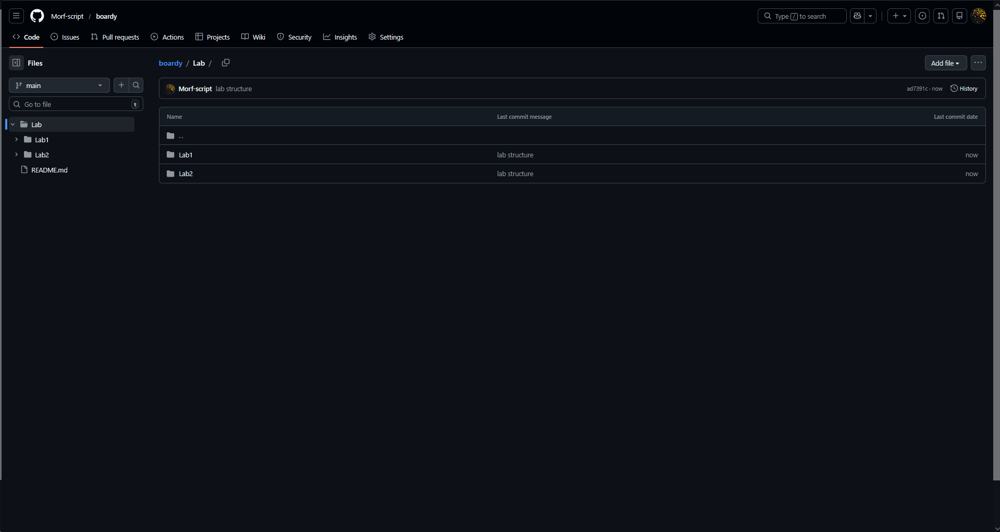
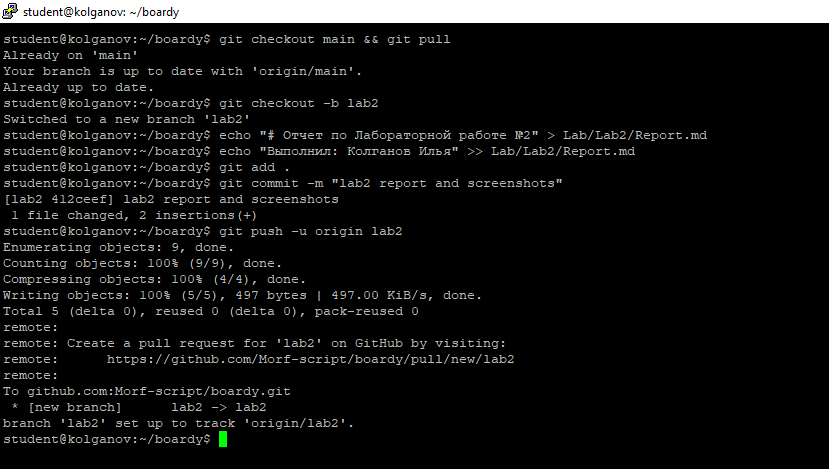
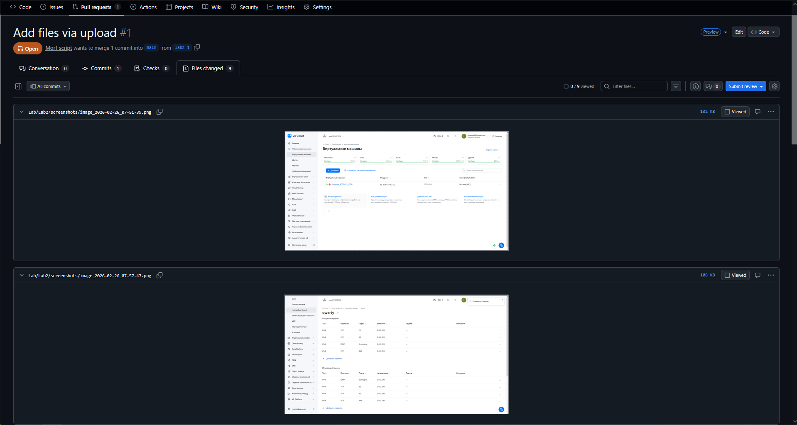

## Лабораторная работа №2

### 1. Создал vm в VK Cloud

### 2. Настроил фаервол

### 3. Подключился по ssh

### 4. Настроил имя хоста и временную зону

### 5. Создал юзера students, настроил права

### 6. Установил гит

### 7. Проверил связь с гитхабом

### 8. Создал структуру

### 9. пуш отчета в ветку 

### 10. созданный PR на GitHub

