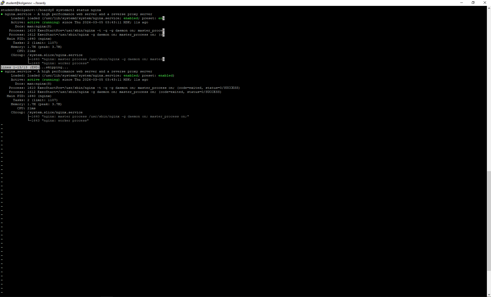
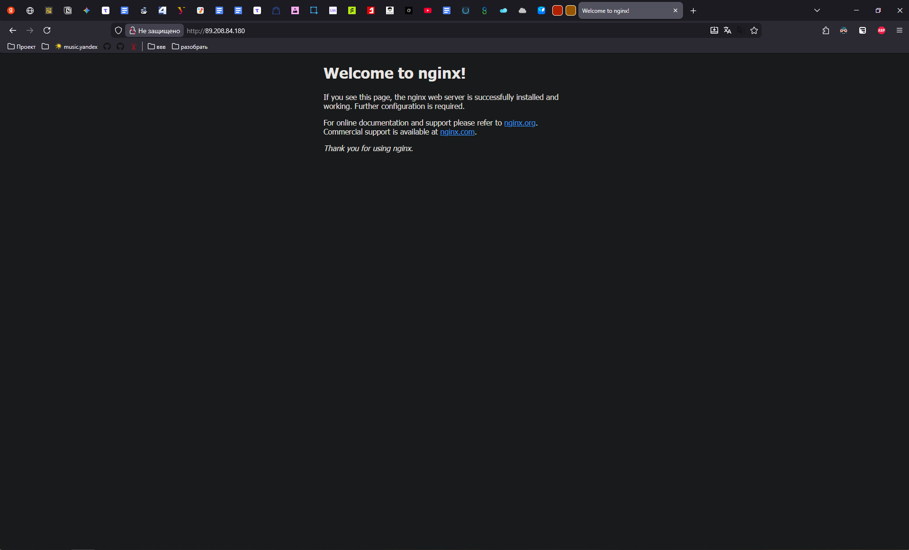
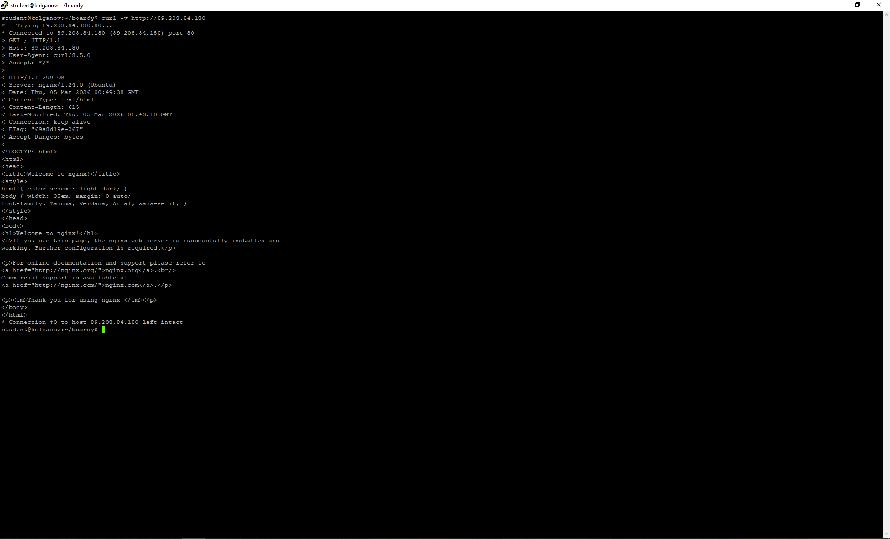
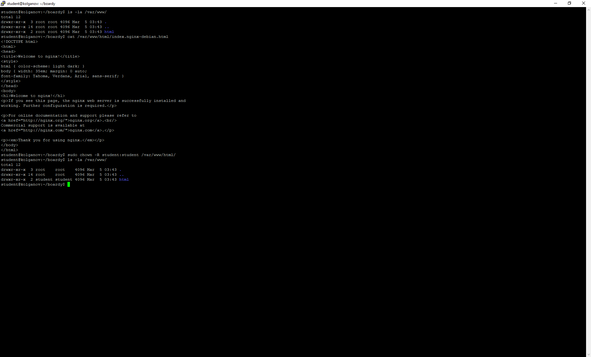
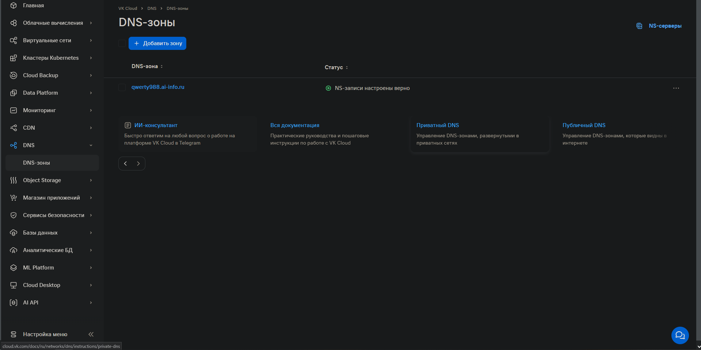
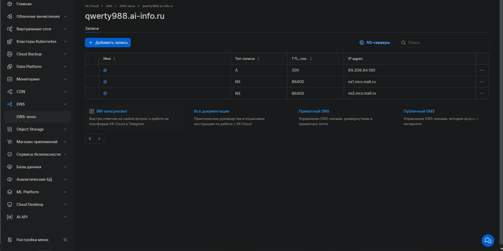
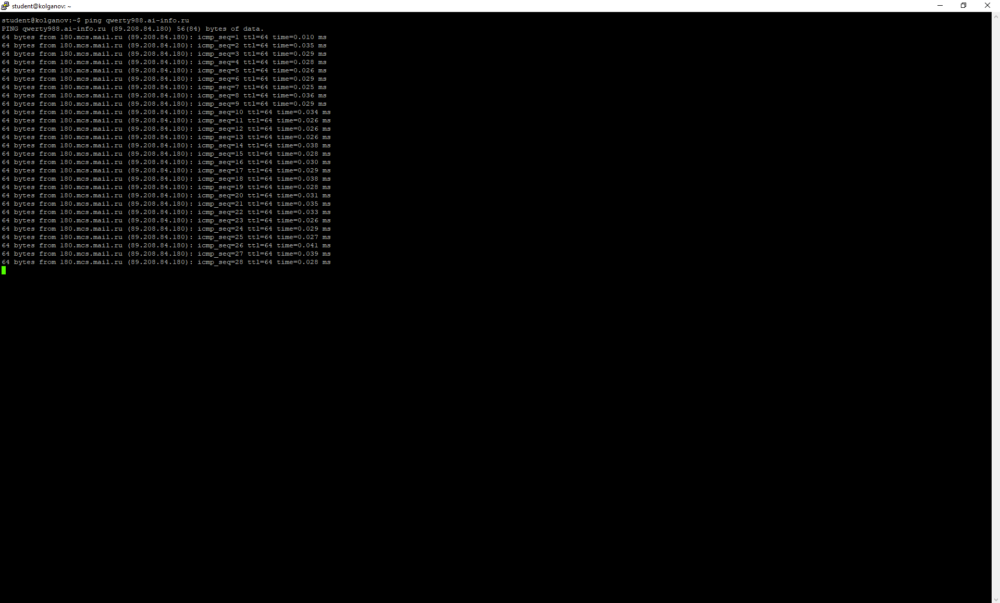
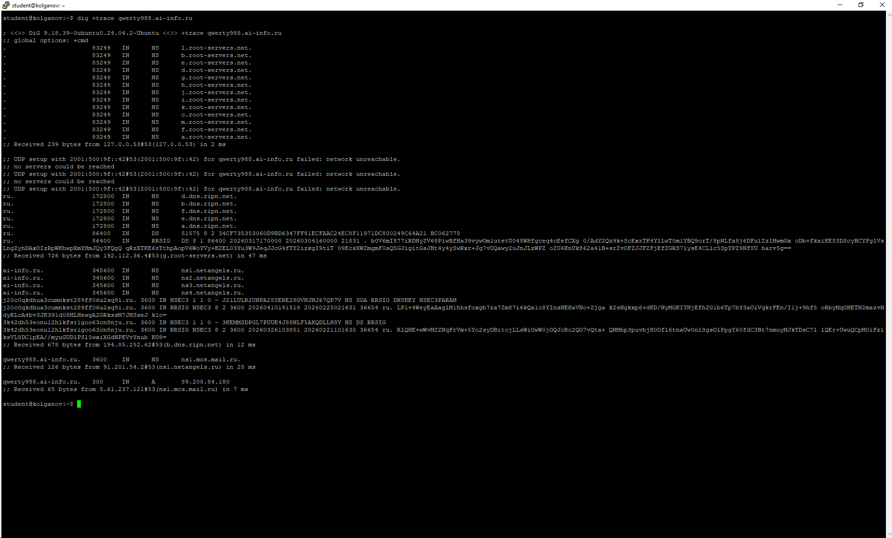
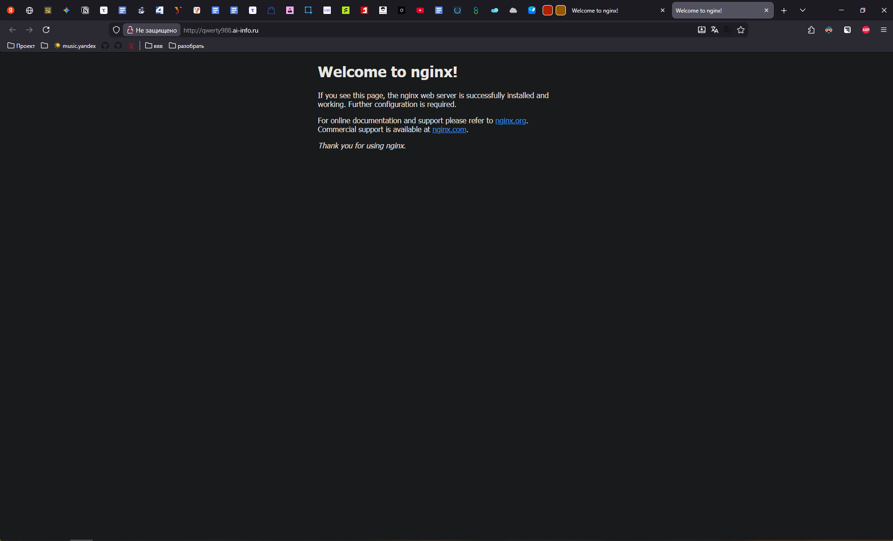

# Отчёт по практической работе №3: Nginx и DNS
**Студент:** Илья Колганов
**Домен:** qwerty988.ai-info.ru
**IP сервера:** 89.208.84.180

## Часть A. Nginx

### Задание 1-2. Установка и проверка

### Задание 3. curl -v
* **Строка запроса:** `GET / HTTP/1.1` - запрос основной страницы.
* **Код ответа:** `200 OK` - сервер обработал запрос и передал содержимое.
* **Content-Type:** `text/html` - передает данные в формате html.

### Задание 4. Директория и права

### Задание 5. Конфигурация Nginx
* **listen 80**: определяет порт, который будет прослушивать сервер (HTTP-80).
* **root**: путь к директории, где Nginx будет брать файлы для отправки пользователю.
* **server_name**: используется для задания доменных имен, на которые должен отвечать сервер.
* **index**: список файлов, которые Nginx будет отдавать в качестве главной страницы.

---

## Часть B. DNS

### Задание 6-7. DNS зона и A-записи

### Задание 8-9. ping и dig

* **QUESTION SECTION:** `;qwerty988.ai-info.ru. IN A` - что спросили.
* **ANSWER SECTION:** `qwerty988.ai-info.ru. 199 IN A 89.208.84.180` - ответ сервера.
* **SERVER:** `127.0.0.53#53` - кто овтетил.

### Задание 10. dig +trace
1. **Корень (`.`):** обращение к корневым серверам (ru).
2. **Зона `.ru`:** получение адресов серверов, обслуживающих зону RU.
3. **NS-серверы `ai-info.ru`:** получение данных о домене второго уровня.
4. **A-запись:** получение ip от vk_cloud.

### Задание 11. Сайт по домену
 
