# Лабораторная работа №5: HTTPS
**Студент:** Колганов Илья Л-01

Часть A. HTTPS для основного сайта
Задание 1. Установка certbot
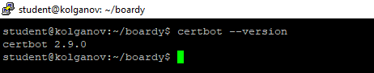

Задание 2. Получение сертификата
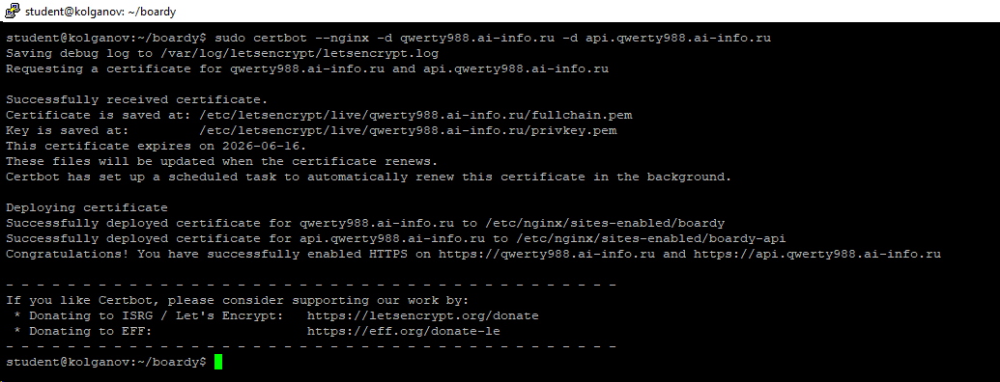

Задание 3. Проверка в браузере
браузер с замочком
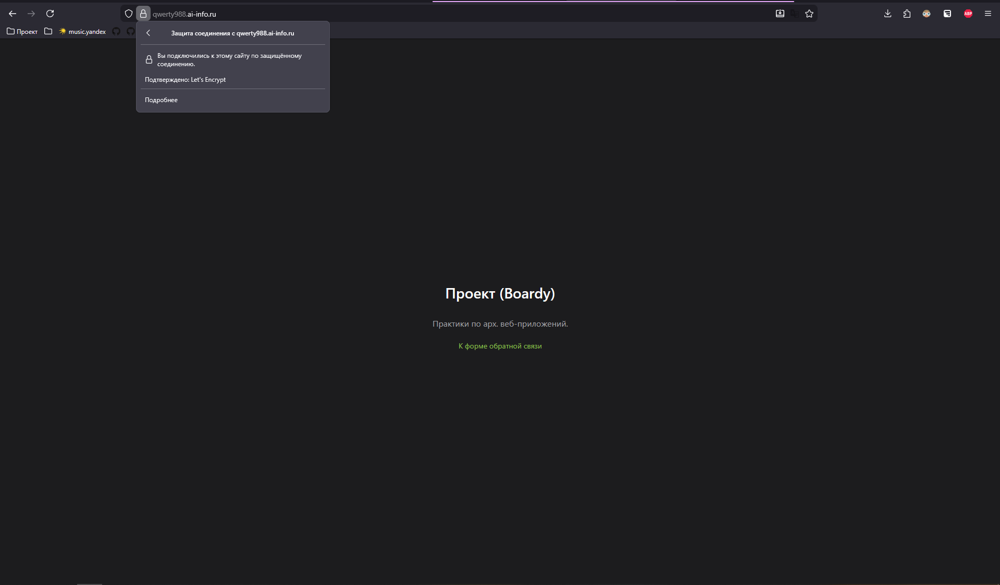

информация о сертификате
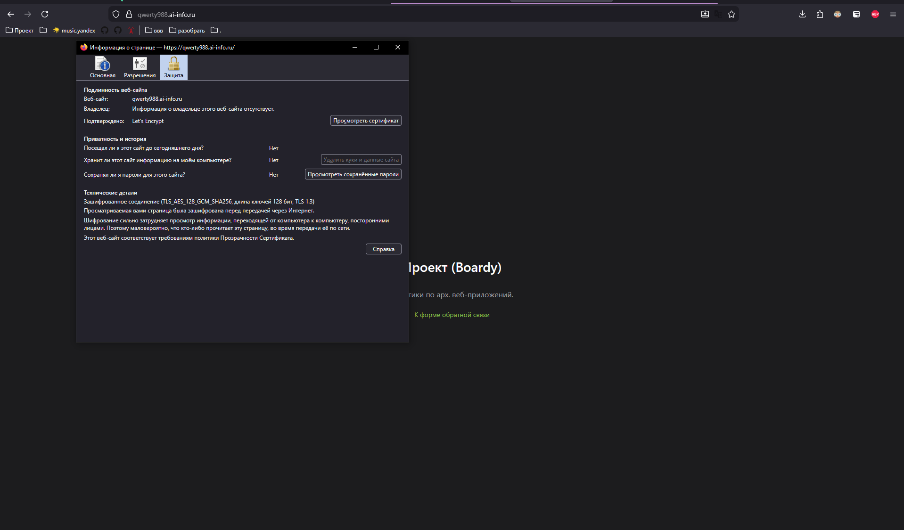

Задание 4. Редирект
При обращении по http перенаправляем на защищенную версию сайта.

Код ответа: 301 Moved Permanently (ресурс перемещен навсегда).

Заголовок Location: https://qwerty988.ai-info.ru/.
[05-redirect.png](./screenshots/05-redirect.png)

Задание 5. Конфиг после certbot
* `listen 443 ssl` - слушаем 443 порт с использованием ssl.
* `ssl_certificate` - путь к файлу сертификата домена
* `ssl_certificate_key` - путь к приватному ключу сертификата
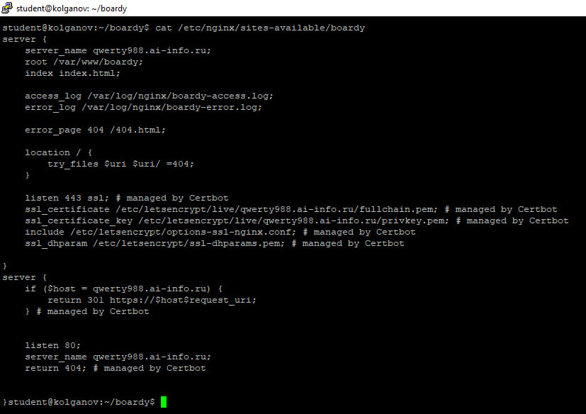

Часть B. HTTPS для API-сервиса
Задание 6. Сертификат для api-поддомена
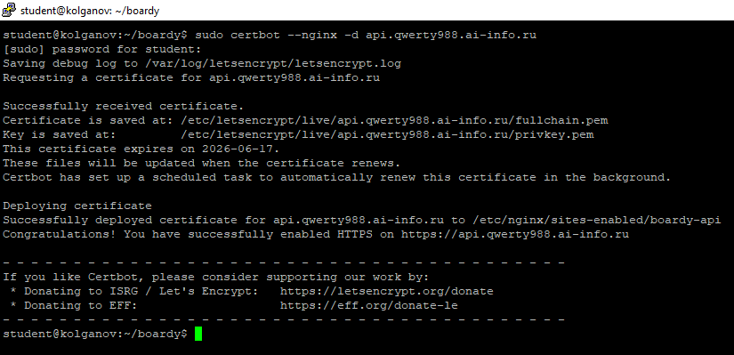

Задание 7. Проверка обоих доменов
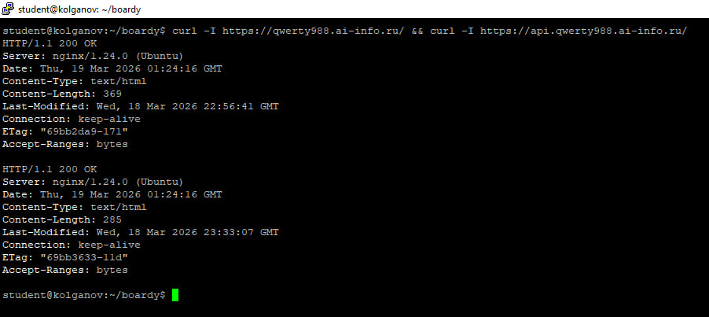

Часть C. Разбор TLS
Задание 8. TLS handshake
Версия TLS: TLSv1.3
Алгоритм шифрования: TLS_AES_256_GCM_SHA384
Subject: CN=qwerty988.ai-info.ru
Issuer: C=US, O=Let's Encrypt, CN=E
Срок действия: до 16 июня 2026 года
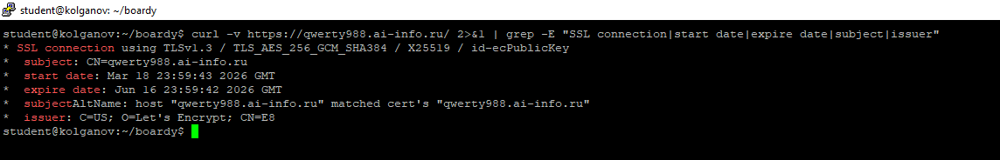

Задание 9. Цепочка доверия
ISRG Root X1 (Root CA) - Let's Encrypt E8 (Intermediate CA) - qwerty988.ai-info.ru (Leaf Certificate)
Браузер смотрит сертификат сайта и проверяет подпись его издателя. Далее браузер проверяет сертификат издателя, что он подписан, после соединение считается безопасным
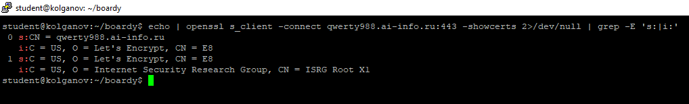

Задание 10. Сравнение сертификатов
Оба сертификата выданы одним и тем же удостоверяющим центром и имеют одинаковый срок действия, но у них разные серийные номера и отпечатки, т.к генерились отдельно. 
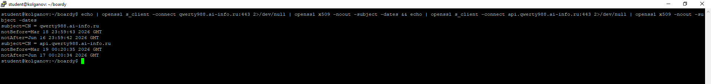

Задание 11. HSTS
HSTS - механизм, который говорит браузеру использовать только https, тем самым запрещая передачу данных по незащищенному каналу.
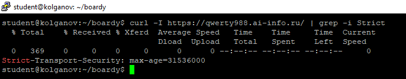

Задание 12. Кэширование и gzip
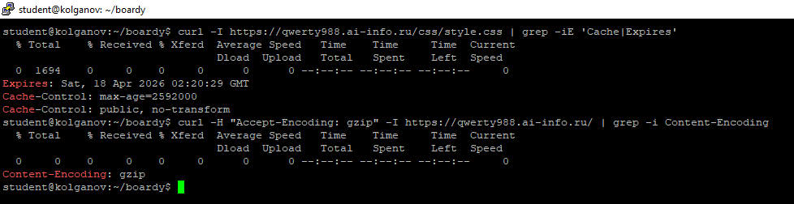

Задание 13. Автообновление
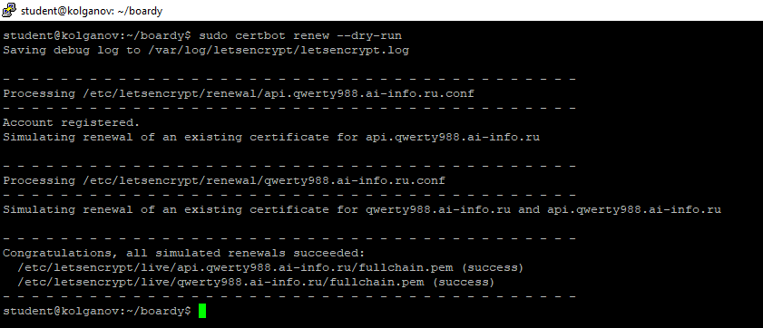

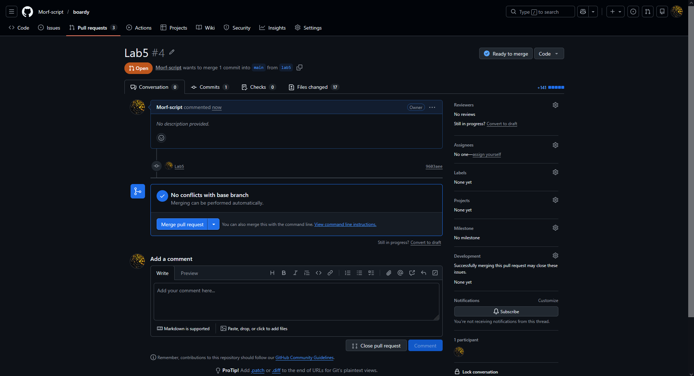
