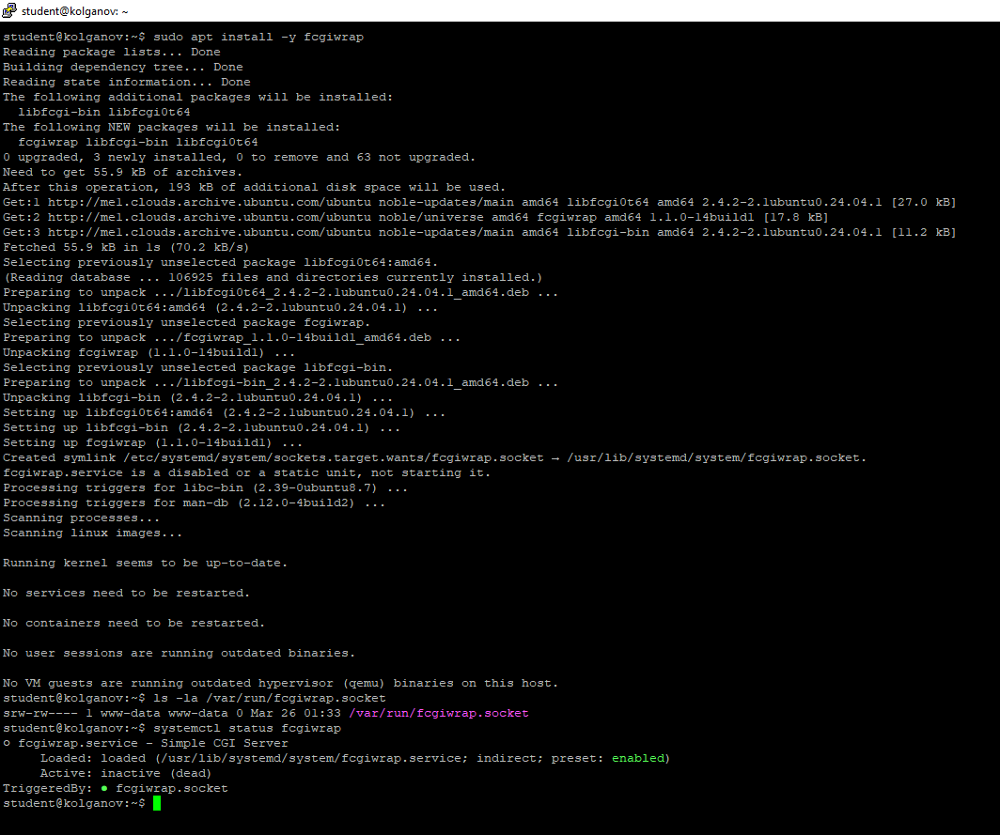
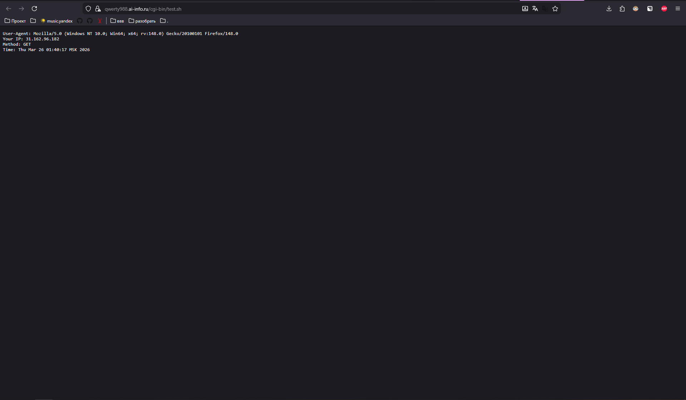
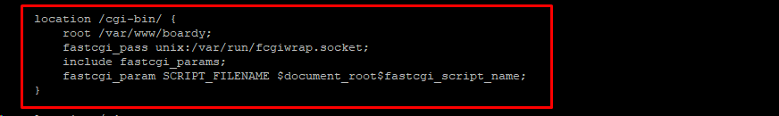
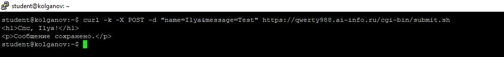
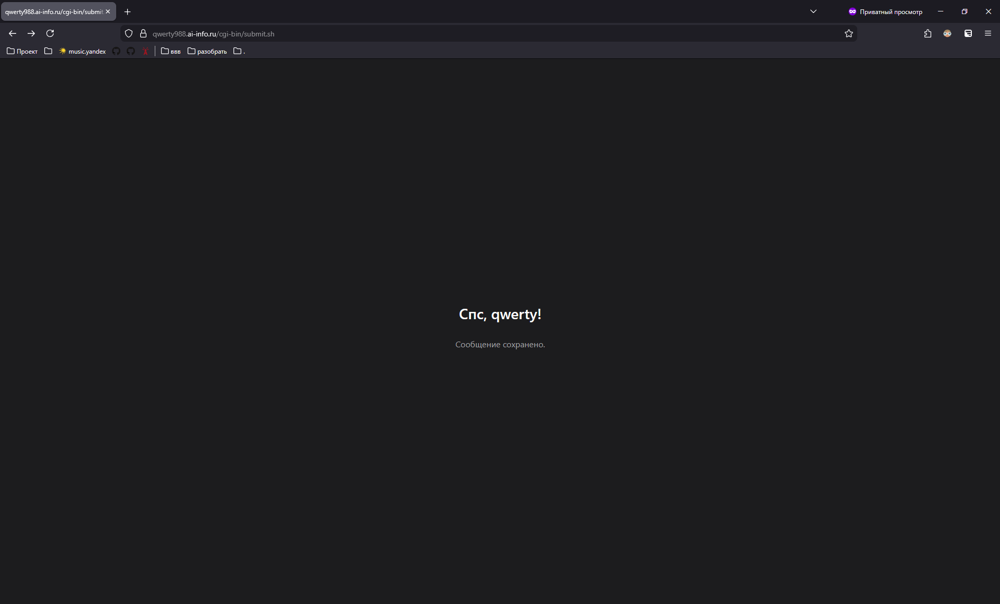
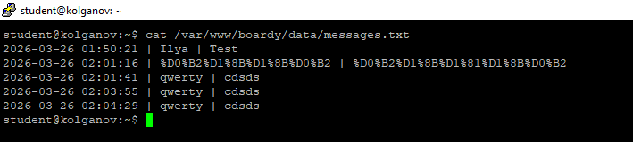
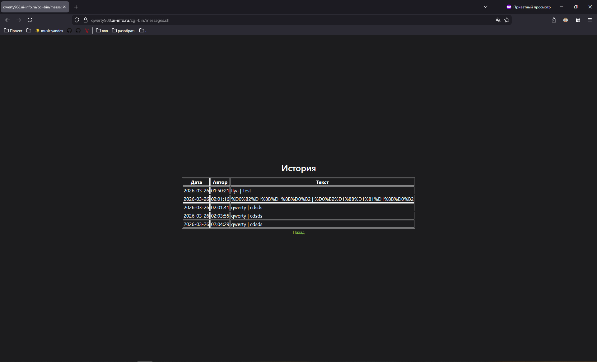
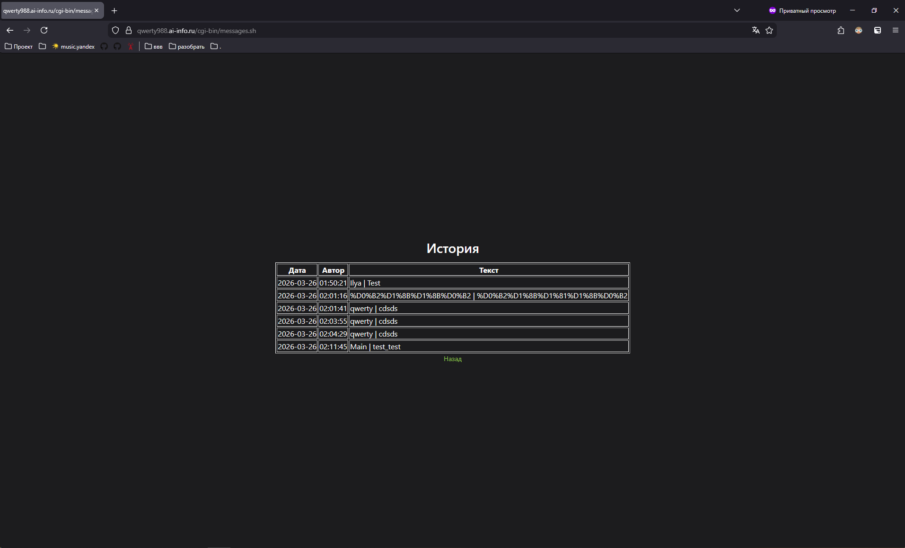
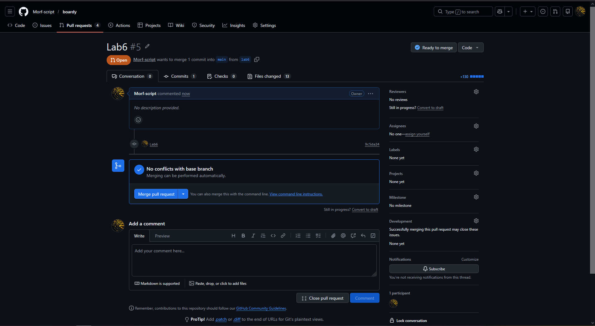

# Отчёт по лабораторной работе №6
**Студент:** Колганов Илья Л-01
**Тема:** CGI

## Часть A. CGI-скрипт
### 1. вывод systemctl status fcgiwrap (active)

### 2. результат в браузере (время, метод GET, IP)

### 3. добавленный блок location в конфиге

root /var/www/boardy; - опредлеяем корневую директорию 
* fastcgi_pass unix:/var/run/fcgiwrap.socket; - не открывай файл сам, а перекинь запрос в fcgiwrap через сокет
* include fastcgi_params; - подключаем список настроек для FastCGI
* fastcgi_param SCRIPT_FILENAME $document_root$fastcgi_script_name; - склеивает путь из root и имя файла

## Часть B. Форма Boardy
### 4. вывод curl -X POST -d "name=...&message=..." (ответ «Спасибо»)

### 5. страница «Спасибо, {ваше имя}!» в браузере

### 6. содержимое файла (минимум 3 сообщения)

## Часть C. Страница сообщений
### 7. страница сообщений в браузере (таблица с данными)

### 8. новое сообщение в таблице

## Часть D. Анализ
### 9. Схема пути запроса
Браузер (POST) - HTTPS - Nginx - FastCGI - fcgiwrap - submit.sh - stdin - messages.txt - stdout - Nginx - браузер (HTML).

### 10. Теоретические вопросы
1). **Что такое CGI и какую проблему он решил в 1993 году?** Это стандарт связи веб-сервера и скриптов на сервере. Благодаря нему можно например передать ввод пользователя скрипту - дождаться исполнения - что-то вернуть. До его появления такого функционала не было, эту проблему он и решил. 
2). **Как CGI-скрипт получает данные POST-запроса?** Данные POST-запроса передаются в теле http-пакета. Веб-сервер принимает этот пакет и перенаправляет содержимое в stdin скрипта. 
3). **Почему CGI создаёт проблемы при высокой нагрузке?** Каждый входящий http-запрос веб-сервер должен создавать отдельный процесс. Если с сайтом будут работать одновременно много пользователей, то не хватит оперативки и ресурсов процессора
4). **Чем отличается fastcgi_pass от proxy_pass?** fastcgi_pass предполагает работу по протоколу FastCGI, который нужен для общения со скриптами. proxy_pass же, это универсальный способ переслать http=запрос на другой адрес
5). **Зачем нужен fcgiwrap, если Apache запускает CGI напрямую?** Nginx нужен как максимально легкое и быстрое решение, он не умеет запускать сторонние процессы. fcgiwrap же принимает запросы от nginx и выполняет .sh скрипты. В отличие от апача, в nginx делегируется задача ради производительности

